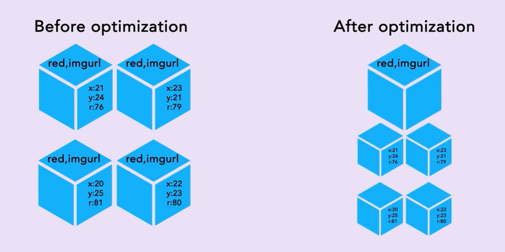

# Dodge Ball Game - Flyweight Design Pattern

## What is the Flyweight Design Pattern?

The **Flyweight Design Pattern** is used to reduce memory usage when creating many similar objects. Instead of creating a new object every time, we reuse existing objects if they have the same properties. This saves both time and memory.  

It is often combined with the **Factory Pattern** to manage the creation and reuse of objects.  

---

## About This Code  

This code is a **Dodge Ball Game** example that demonstrates the Flyweight Design Pattern.  

### Problem:  
In a dodge ball game, every ball has properties like color and image. If we create a new ball object for every player, we waste memory because many balls will have the same color and image.  

### Solution:  
Using the **Flyweight Design Pattern**, we:  
- **Reuse balls** that have the same color and image.  
- **Store shared balls** in a `BallFactory` to avoid creating duplicate objects.  

---

## Key Components in the Code  

1. **Ball**:  
   An interface with a `display()` method to show ball details.  

2. **DodgeBall**:  
   Represents a dodge ball with properties like `color` and `image`.  

3. **BallFactory**:  
   - Responsible for creating and managing balls.  
   - Checks if a ball with the same color and image already exists.  
   - If it exists, it reuses it. Otherwise, it creates a new one.  

4. **Player**:  
   Each player is assigned a ball. They can display ball details.  

---

## How It Works  

1. **Create or Reuse Balls**:  
   - If a ball with the requested color and image exists, reuse it.  
   - If it doesn't exist, create a new one and store it.  

2. **Assign Balls to Players**:  
   - Players get dodge balls through the factory, ensuring no duplicate balls are created.  

